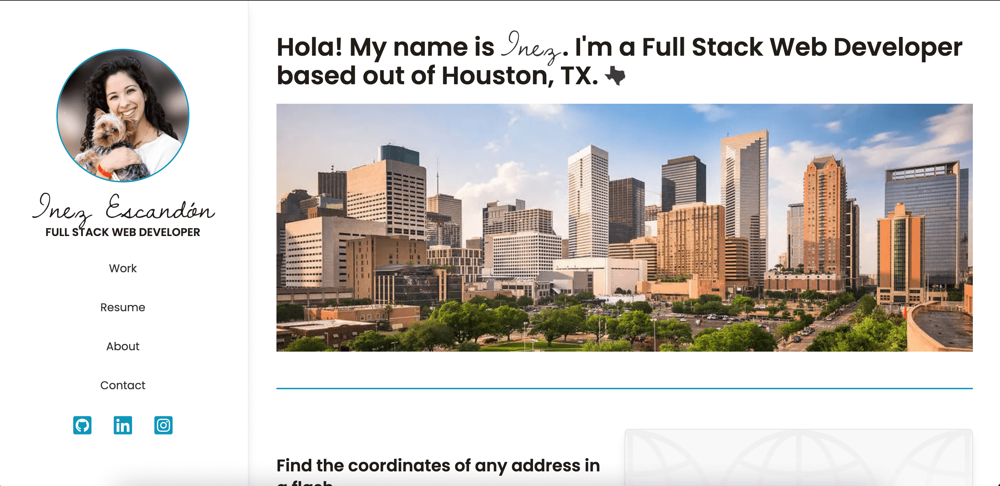

# Inez Escandon's Portfolio [GitHub license](https://img.shields.io/badge/license-MIT%20License-blue.svg)

# Live Site

https://inescandon.vercel.app/

## Description

`

This application is a client-side application that serves as my portfolio. Users can click on work to view websites I have created independently and collaboratively. Users can click on about and resume to learn more about me and my skills. Users can click on contact and send me a message using the contact form on the page. Created with Next.JS and styled with Tailwind CSS. Mobile responsive.

## Table of Contents

- [Installation](#installation)
- [Usage](#usage)
- [Technologies](#technologies)
- [License](#license)
- [Credits](#credits)
- [Tests](#tests)
- [Questions](#questions)

## Installation

In order to install this project, you must login to GitHub and go to github.com/iescandon/inescandon. Once there you will click on the green button that says clone or download. You will be given choices on how to download: using the ssh/html key or downloading the zip file.

Using SSH/HTML Key: You will copy the link shown and open up either terminal (mac: pre-installed) or gitbash (pc: must be installed). Once the application is open, you will type git clone _paste url here_. Once you have cloned the htx-tacos repo, cd into the repo and type "open ." to open the folder which contains all files used for the website. You can also type "code ." to open the repo in VS code.

Using Download ZIP: Click on Download Zip. Locate the file and double click it to unzip the file. Locate the unzipped folder and and open it. All the files for the website will be within this folder.

## Usage

Simply click on the live link listed above and use the website as normal.

## Technologies

- Next.JS
- Tailwind CSS
- Formspree

## License

Copyright (c) [2020][inezescandon]  
The license is MIT License.  
Read more about it at https://opensource.org/licenses/MIT.

## Credits

None

## Tests

No tests available.

## Questions

If you have any additional questions please contact me at iescan4@gmail.com.  
GitHub: https://github.com/iescandon

